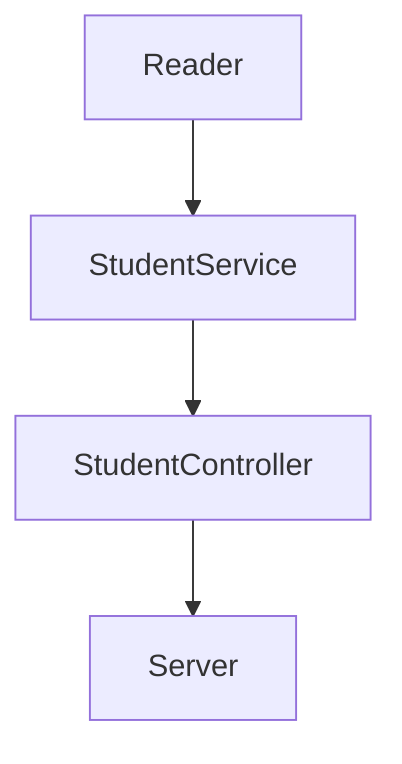

# Visual-Thinking-API
Api para devolver información de los alumnos de Visual Partner-Ship

# Solicitud
1. Habilitar un endpoint para consultar todos los estudiantes con todos sus campos.
2. Habilitar un endpoint para consultar los emails de todos los estudiantes que tengan certificación `haveCertification`.
3. Habilitar un endpoint para consultar todos los estudiantes que tengan `credits` mayor a 500.

# Dependencias
En el proyecto se usaron las siguientes dependencias:
  - Linter que es herramienta que ayuda a la legibilidad de nuestro codigo. se instala con el comando > npm install eslint --save-dev 
      La documentacio completa se encuentra en: https://eslint.org/docs/rules/
      
  - Jest la cual nos ayuda a llevar a cabo purbas, se ejecuta con el comando > npm install --save-dev jest .
    La documentacion completa se encuentra en: https://jestjs.io/
    
  - La dependencia de express nos permite montar un server server, al igual que exponer endpoints, con el comando > npm install express --save .
    La documentacion completa se encuentra en: https://expressjs.com/es/
    
  - Automatizacion de pruebas unitarias para github con la creacion del archivo .github/workflows/test.yml

# Diseño de componentes

# Proceso
En esta seccion se enlistan los pasos para la creacion del proyecto:

- Crear carpeta local .
- Inicializar git .
- Crear repositorio en GitHub .
- Enlazamos nuestro proyecto local al  repositorio de GitHub con git remote add origin y la ur del repositorio que creamos .
- Ejecutamos npm init para crear nuestro proyecto con lo cual se crea un packaje.json .
- Se agrega la dependencia para test (jest) con el comando npm install --save-dev jest .
- Se agrega .gitiginore para no versionar los node modules.
- Agregamos el scrips al package.json .
- Se instala ESLint en ten el proyecto, esto para definir las reglas de la programación, usamos el comando npm install eslint --save-dev .
- Se ejecuta el comando npm init @eslint/config para generar la configuración del linter,
    - se eligee la segunda opción (To check syntaxys and find problems)
    - commons
    - no
    - browser
    - javascript
- Se configura en el archivo .eslintrc.js .
- Agregamos los scrips al package.json .
- Instalamos la dependencia express: npm install express --save .
- Creamos un archivo llamado server.js y creamos la  configuración y endpoint del servidor .
- Agregamos en scrips la linea "server": "node ./lib/server.js" en package.json para que el servidor corra con npm run server .
- Crea un nuevo archivo con la ruta: .github/workflows/test.yml .
- Se crea el test para la clase StudentService y su método getAllStudents .
- Se crea el código para la clase StudentService getAllStudents .
- Se crea el test para la clase StudentService y su método getMailStudentsCertificated .
- Se crea el código para el metodo getMailStudentsCertificated en la clase StudentService .
- Se crea el test para la clase StudentService y su método getStudentsWithCredits .
- Se crea el código para el metodo getStudentsWithCredits en la clase StudentService .
- Se crea el test para getStudentsWithCredits .
- Se crean las pruebas para los metodos de StudentController (getAllStudents, getMailStudentsCertificated, getStudentsWithCredits)
- Se crean el codigo para los metodos de StudentController (getAllStudents, getMailStudentsCertificated, getStudentsWithCredits) cosument los metodos de la clase StudentService.
- Se crean los endpoints que consumento los metodos de StudentController (getAllStudents, getMailStudentsCertificated, getStudentsWithCredits)

# Resultado
Una vez hecho lo anterior, corrido las pruebas y haber corrido linter el resultado es el siguiente:

http://localhost:3000/v1/students/credits

http://localhost:3000/v1/students/email

http://localhost:3000/v1/students

